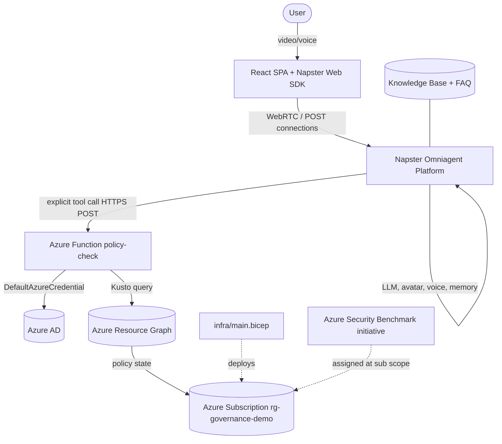
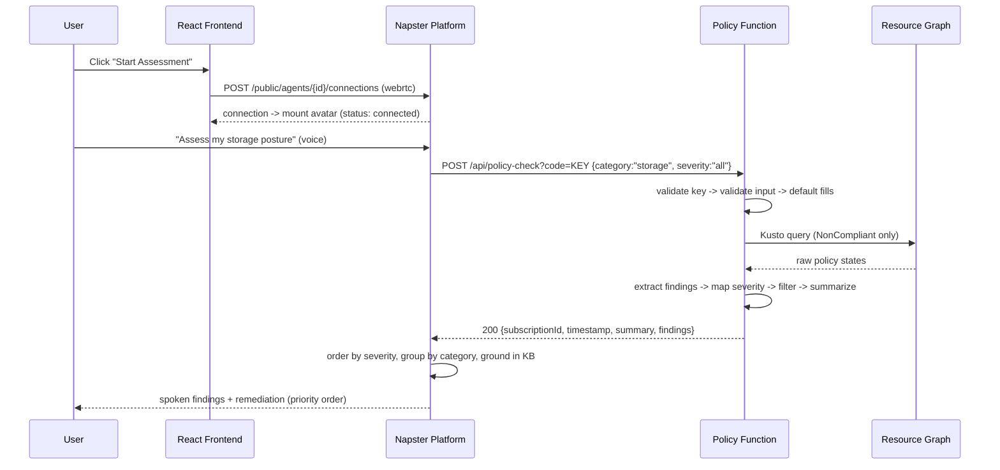
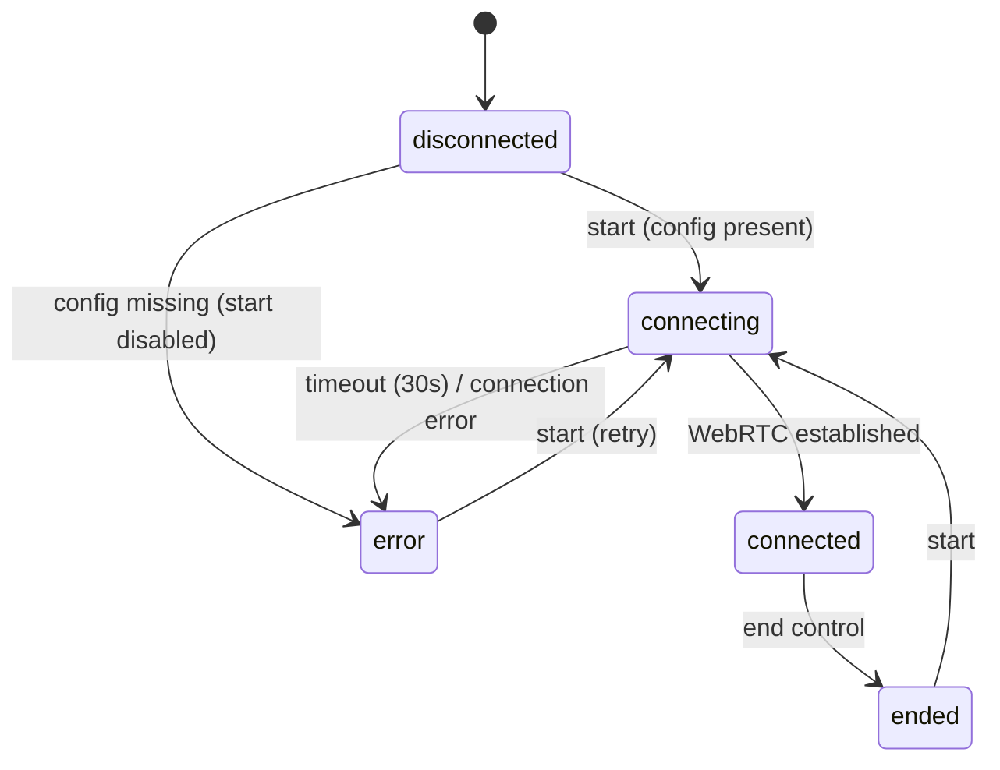

# Design Document

## Overview

The Azure Governance Baseline Advisor is a multimodal AI agent that conducts a live, face-to-face video and voice conversation with a user while performing a real Azure Policy baseline assessment. The system is composed of five collaborating components that span infrastructure, a serverless tool backend, a hosted agent platform, curated knowledge, and a thin web client:

1. **Demo Azure Environment** (`infra/main.bicep`) — an idempotent Bicep template that provisions a deterministic mix of compliant and non-compliant resources in `rg-governance-demo`, plus the Azure Security Benchmark initiative assignment at subscription scope.
2. **Policy Function** (`function/`) — an Azure Functions v4 / Node.js 20 / TypeScript HTTP endpoint (`POST /api/policy-check`) that authenticates with `DefaultAzureCredential`, queries Azure Resource Graph for non-compliant resources, maps each finding to a severity, applies category/severity filters, and returns a structured JSON response.
3. **Napster Omniagent Configuration** — the assembled agent "Morgan Cole" (companion + voice + avatar + memory), wired to the policy tool, knowledge base, and FAQ collection through Napster's public API.
4. **Governance Knowledge Base & FAQ Collection** (`knowledge/`) — grounding content covering the five governance categories plus consistent answers to common questions.
5. **React Web Frontend** (`frontend/`) — a single-page Vite app embedding the Napster Web SDK to manage the WebRTC session lifecycle.

The design separates concerns cleanly: the **transport and presentation** layer (frontend + Napster platform) is independent from the **compliance logic** layer (Policy Function), which is independent from the **environment under test** (Bicep-deployed resources). The Policy Function is the only component containing meaningful, testable business logic (input validation, severity mapping, filtering, response shaping), and it is therefore the primary focus of correctness properties.

### Design Goals and Constraints

- **Hackathon scope**: weekend sprint, built-in Azure policies only, no custom policy authoring, no over-engineering.
- **Live data over mocks**: the demo's credibility rests on querying a real subscription, with a mock fallback path reserved only for demo-day risk mitigation.
- **Determinism where it counts**: the Bicep template is idempotent, and severity mapping is a pure, stable lookup so the same policy always yields the same severity.
- **Grounded conversation**: the agent must never fabricate compliance data or governance impact — it calls the tool before making claims and grounds explanations in the knowledge base.

### Research Notes

Key technical facts that inform the design, drawn from the source spec and Azure/Napster platform behavior:

- **Azure Policy evaluation is asynchronous.** Compliance state is not populated instantly after deployment; Azure evaluates on a ~24-hour cycle for existing resources and within minutes for new ones. An on-demand scan (`az policy state trigger-scan`) is required before the demo, and it can take 15–30 minutes to reach a terminal state. This drives Requirement 2's 30-minute terminal-state constraint and the timeout handling.
- **Azure Resource Graph** exposes policy state through the `policyresources` table (`microsoft.policyinsights/policystates`). Compliance state, resource identifiers, policy definition names, and policy category are all projectable fields. Some fields (display name, category, resource group) may be absent on individual rows, which drives the empty-string population rule in Requirement 5.4.
- **Napster Omniagent API** (`https://companion-api.napster.com`, header `X-Api-Key`) exposes public endpoints for companions, knowledge bases, functions (tools), FAQs, agents, and per-agent WebRTC connections. Tools use an `explicit` flow where the platform issues an HTTPS POST to the configured URL (with the function key embedded as a `code` query parameter). Persistent memory, avatar, and voice are platform-managed features enabled through agent assembly.
- **Least-privilege RBAC**: querying policy compliance state requires only read roles. The Function App's managed identity needs `Reader` and `Resource Policy Reader` on the subscription and nothing more (Requirement 8).

## Architecture

### System Context



### Layered Responsibilities

| Layer | Component | Responsibility | Testability |
|-------|-----------|----------------|-------------|
| Presentation / Transport | React Frontend, Napster Web SDK | Session lifecycle, avatar mount, status display | Example-based (UI/state machine) |
| Agent Orchestration | Napster Omniagent (Morgan Cole) | Persona, conversation flow, tool invocation, grounding, memory | Configuration/integration, not PBT |
| Compliance Logic | Policy Function | Auth, input validation, query, severity mapping, filtering, response shaping | **Property-based + unit** |
| Environment | Bicep template + initiative assignment | Deterministic compliant/non-compliant resources | Snapshot/integration (IaC) |

### Request Flow (Assessment Path)



### Technology Choices

- **IaC**: Bicep, single flat file, no modules/parameters — fastest path to an idempotent deploy. Hardcoded `demo-`/`demo` names for easy cleanup and stable identification.
- **Function runtime**: Azure Functions v4 + Node.js 20 + TypeScript. The v4 programming model registers HTTP routes in code. Function-level auth key gates every request.
- **Azure SDKs**: `@azure/identity` (`DefaultAzureCredential`) and `@azure/arm-resourcegraph`.
- **Frontend**: React via Vite, Napster Web SDK, deliberately minimal (no UI framework). Config injected via `VITE_`-prefixed environment variables.

## Components and Interfaces

### Component 1: Demo Environment (`infra/main.bicep`)

A single idempotent template targeting `rg-governance-demo`. It declares each resource with a fixed name and fixed properties so repeated deployments produce no diff (Requirement 1.2). Resources fall into two groups:

**Intentionally non-compliant (the findings):**
- Storage account with `supportsHttpsTrafficOnly: false`.
- Storage account with blob soft delete disabled.
- NSG with an enabled inbound Allow rule, source `0.0.0.0/0`, destination port `3389`.
- VM with zero tags.
- Key Vault with purge protection disabled.
- SQL database with auditing not configured.
- VM with no diagnostic settings.

**Intentionally compliant (the contrast):**
- Storage account with HTTPS-only + soft delete + private endpoint.
- NSG whose every inbound rule uses a scoped (non-`0.0.0.0/0`) source.
- Key Vault with both purge protection and soft delete enabled.

Naming: every demo resource carries a `demo` token, using the `demo-` hyphenated prefix where the resource type permits hyphens (storage accounts and key vaults, which disallow hyphens, embed a `demo` token in their globally-unique names). Only built-in policy definitions/initiatives are used (Requirement 1.14).

**Initiative assignment** (Requirement 2): a `Microsoft.Authorization/policyAssignments` resource assigns the Azure Security Benchmark initiative (`1f3afdf9-d0c9-4c3d-847f-89da613e70a8`) at subscription scope. Assignment failures surface an error without mutating prior assignment state. On-demand evaluation is triggered out-of-band (`az policy state trigger-scan`) and must reach `completed`/`failed` within 30 minutes, with a timeout indication that retains prior state.

### Component 2: Policy Function (`function/`)

The functional core. Internal modules:

```
function/src/
  functions/policy-check.ts   # HTTP trigger: auth, orchestration, HTTP status mapping
  lib/input.ts                # parse + validate + default request body
  lib/resource-graph.ts       # build & execute Kusto query, extract findings
  lib/severity-map.ts         # pure policy-name -> severity lookup
  lib/filter.ts               # apply category/severity filters
  lib/response.ts             # build summary + response envelope
```

#### HTTP Interface

```
POST /api/policy-check?code=<function-key>
Content-Type: application/json

{ "category": "all|networking|storage|identity|compute|logging", "severity": "all|high|medium|low" }
```

Both fields optional; absent/empty → `all`. Matching is case-insensitive.

**Status code contract:**

| Condition | Status | Body |
|-----------|--------|------|
| Success | 200 | full response envelope |
| Missing/invalid function key | 401 | `{ error: "authorization failed" }` |
| Invalid `category` value | 400 | error naming `category` + accepted values |
| Invalid `severity` value | 400 | error naming `severity` + accepted values |
| Body present but not valid JSON | 400 | error: body could not be parsed |
| `DefaultAzureCredential` token failure | 500 | error: authentication failure |
| Resource Graph query failure/timeout | 500 | error: query failure (no partial findings) |

Validation precedence: function-key auth → JSON parse → field validation → credential acquisition → query. Each gate, on failure, returns before executing the Resource Graph query (Requirements 3.3, 4.6–4.8, 3.7, 5.5).

#### Input Module (`lib/input.ts`)

`parseAndValidate(rawBody): Result<NormalizedInput, ValidationError>`:
1. If body non-empty and not parseable JSON → parse error (400).
2. Read optional `category`, `severity` strings.
3. Empty/absent → `all`.
4. Lowercase and check membership in accepted sets; reject out-of-set values with field-specific error (400).
5. Return `{ category, severity }` normalized to lowercase canonical values.

#### Resource Graph Module (`lib/resource-graph.ts`)

Builds the Kusto query (always filtering `complianceState == "NonCompliant"`), executes it via `@azure/arm-resourcegraph`, and extracts each row into a raw finding. Missing `policyDisplayName`, `category`, or `resourceGroup` are populated as empty strings rather than dropping the row (Requirement 5.4). Query must complete within 30s or yield a 500 with no partial results.

```kusto
policyresources
| where type == "microsoft.policyinsights/policystates"
| where properties.complianceState == "NonCompliant"
| extend resourceId = properties.resourceId,
         resourceType = properties.resourceType,
         policyName = properties.policyDefinitionName,
         policyDisplayName = properties.policyDefinitionDisplayName,
         category = properties.policyDefinitionCategory,
         resourceGroup = properties.resourceGroup
| project resourceId, resourceType, policyName, policyDisplayName, category, resourceGroup
```

#### Severity Mapper (`lib/severity-map.ts`)

Pure function `severityFor(policyName): "high"|"medium"|"low"`:
- Hardcoded lookup table keyed by known policy definition names that fire against the demo resources.
- `high`: open network access to `0.0.0.0/0`, missing encryption, missing Key Vault purge protection.
- `medium`: missing diagnostic settings, disabled soft delete, missing tags.
- `low`: informational / naming-convention policies.
- Unknown policy name → default `low` (Requirement 6.5).
- Deterministic: identical policy name → identical severity every call (Requirement 6.6).
- If a name could match multiple tiers, precedence `high > medium > low` resolves it (Requirement 6.7).

#### Filter Module (`lib/filter.ts`)

`applyFilters(findings, category, severity)`:
- `category != all` → keep findings whose category equals it.
- `severity != all` → keep findings whose severity equals it.
- both set → conjunction (AND).
- both `all` → return all.

#### Response Module (`lib/response.ts`)

`buildResponse(subscriptionId, findings)` constructs the envelope: derives the per-category breakdown (one count per category, zero where none), sets `summary.totalNonCompliant` equal to `findings.length`, ensures the per-category counts sum to the total, and stamps an ISO-8601 UTC `Z` timestamp.

### Component 3: Napster Omniagent Configuration

Assembled through the Napster public API (`X-Api-Key` header):

- **Companion** (`POST /public/companions`): `firstName: "Morgan"`, `lastName: "Cole"`, senior governance architect description → `COMPANION_ID`.
- **Knowledge base** (`POST /public/knowledge-bases` + `/files`): governance framework doc → `KNOWLEDGE_BASE_ID`.
- **Tool** (`POST /public/functions`): name `check_policy_compliance`, `flow: "explicit"`, `category`/`severity` enum parameters, `url` = Function endpoint + `?code=<function-key>` → `TOOL_ID`.
- **FAQ collection** (`POST /public/faqs`): four required entries → `FAQ_COLLECTION_ID`.
- **Agent** (`POST /public/agents`): `companionId`, `voiceId: "echo"`, `language: "English"`, `functions: [TOOL_ID]`, `faqCollections: [FAQ_COLLECTION_ID]`, `knowledgeBaseId`, `providerSettings.temperature: 0.4` → `AGENT_ID`.
- **System prompt** configures persona, tool-before-claims discipline, severity-ordered presentation, grounding, and no-fabrication rules.

### Component 4: Knowledge Base & FAQ Content

`knowledge/governance-baseline-framework.md` covers all five categories, each with key controls, common violations, and remediation, plus a three-tier prioritization framework mapping each gap to a high/medium/low tier (Requirement 10.3). The FAQ collection contains one Q→A entry each for: what Azure Policy is, what a policy baseline is, evaluation cadence, and audit vs deny mode.

### Component 5: React Frontend (`frontend/`)

A single page with the avatar as the central element, start/end controls, and a status indicator. It reads `VITE_NAPSTER_API_KEY` and `VITE_AGENT_ID` from env config. Session status is a small state machine:



On start it opens a WebRTC connection (`POST /public/agents/{agentId}/connections`, `channelType: "webrtc"`), mounts the avatar on success, and exposes statuses `disconnected | connecting | connected | ended | error`. A 30s connection timeout or any connection error transitions to `error`, shows an indication, and re-enables start. Missing config at startup shows an error status and disables start.

## Data Models

### NormalizedInput (Policy Function internal)

```typescript
type Category = "all" | "networking" | "storage" | "identity" | "compute" | "logging";
type SeverityFilter = "all" | "high" | "medium" | "low";

interface NormalizedInput {
  category: Category;     // lowercase canonical, defaulted to "all"
  severity: SeverityFilter; // lowercase canonical, defaulted to "all"
}
```

### Finding

```typescript
type FindingCategory = "networking" | "storage" | "identity" | "compute" | "logging";
type Severity = "high" | "medium" | "low";

interface Finding {
  category: FindingCategory; // empty-string source values are retained internally; classified for response
  policyName: string;
  policyDisplayName: string; // "" if absent in source
  resourceId: string;
  resourceType: string;
  resourceGroup: string;     // "" if absent in source
  severity: Severity;        // assigned by Severity_Mapper
}
```

### PolicyCheckResponse

```typescript
interface CategoryBreakdown {
  networking: number;
  storage: number;
  identity: number;
  compute: number;
  logging: number;
}

interface Summary {
  totalNonCompliant: number;     // == findings.length
  byCategory: CategoryBreakdown; // sum(values) == totalNonCompliant
}

interface PolicyCheckResponse {
  subscriptionId: string;
  assessmentTimestamp: string;   // ISO-8601 UTC with "Z"
  summary: Summary;
  findings: Finding[];
}
```

### ErrorResponse

```typescript
interface ErrorResponse {
  error: string;            // human-readable message
  acceptedValues?: string[]; // present for 400 field-validation errors
}
```

### Session State (Frontend)

```typescript
type SessionStatus = "disconnected" | "connecting" | "connected" | "ended" | "error";

interface SessionState {
  status: SessionStatus;
  errorMessage?: string;
  startEnabled: boolean;
}
```

## Correctness Properties

*A property is a characteristic or behavior that should hold true across all valid executions of a system — essentially, a formal statement about what the system should do. Properties serve as the bridge between human-readable specifications and machine-verifiable correctness guarantees.*

These properties target the **Policy Function's pure logic** (input normalization, validation, authorization gating, severity mapping, filtering, extraction, and response shaping) plus the **frontend session-status invariant**. The IaC template, RBAC configuration, Napster agent assembly, knowledge/FAQ content, and LLM conversational behavior are validated through snapshot, integration, and evaluation tests rather than property-based tests (see Testing Strategy). The acceptance criteria below were consolidated during prework to remove redundancy: the per-field defaulting, case-insensitive acceptance, and filtering rules each collapse into a single general property.

### Property 1: Field defaulting to "all"

*For any* request input in which the `category` (or `severity`) field is absent or present as an empty string, the normalized value of that field is `all`.

**Validates: Requirements 4.2, 4.3**

### Property 2: Case-insensitive acceptance and canonical normalization

*For any* accepted `category` or `severity` value in any letter casing, validation accepts the input and normalizes the value to its canonical lowercase form.

**Validates: Requirements 4.1, 4.4, 4.5**

### Property 3: Invalid field values are rejected before any query

*For any* string supplied for `category` or `severity` that lies outside its accepted value set, the function returns HTTP 400 with an error that identifies the offending field and lists the accepted values, and the Resource Graph query is never executed. This also holds *for any* non-empty request body that is not valid JSON (400 parse error, no query).

**Validates: Requirements 4.6, 4.7, 4.8**

### Property 4: Authorization gate precedes the query

*For any* supplied function-level key that does not match the configured key (including an absent key), the function returns HTTP 401 indicating authorization failure and never executes the Resource Graph query.

**Validates: Requirements 3.2, 3.3**

### Property 5: Filtering restricts results to matching dimensions

*For any* set of findings and any `(category, severity)` filter pair, every finding in the returned result matches the filter on each dimension whose value is not `all`; when both dimensions are not `all`, every returned finding matches both; when a dimension is `all`, it imposes no restriction on that dimension.

**Validates: Requirements 4.9, 4.10, 4.11**

### Property 6: Finding extraction is total with empty-string fill

*For any* set of raw Resource Graph rows, every row is retained as a Finding (no row is discarded), each Finding carries the resource identifier, resource type, policy name, policy display name, category, and resource group, and any optional source field (policy display name, category, resource group) that is absent is populated with an empty string.

**Validates: Requirements 5.3, 5.4**

### Property 7: Severity assignment is total, defaulted, and deterministic

*For any* policy name, the Severity_Mapper returns exactly one value in `{high, medium, low}`; the same policy name always yields the same severity across repeated and independent calls; and any policy name absent from the lookup table yields `low`.

**Validates: Requirements 6.1, 6.5, 6.6**

### Property 8: Response structure and counting invariants

*For any* set of findings, the built response contains a `subscriptionId`, an `assessmentTimestamp` formatted as an ISO-8601 UTC timestamp with the `Z` designator, a `summary`, and a `findings` array; the `summary.byCategory` breakdown contains a count for each of the five categories (networking, storage, identity, compute, logging); each category count equals the number of findings in that category (zero when none); `summary.totalNonCompliant` equals the length of the `findings` array; the per-category counts sum to `summary.totalNonCompliant`; and every finding in the response carries a valid `category` enum, `policyName`, `resourceId`, `resourceType`, and valid `severity` enum.

**Validates: Requirements 7.1, 7.2, 7.3, 7.4, 7.6, 7.7, 7.8**

### Property 9: Session status invariant

*For any* sequence of frontend session lifecycle events (start, established, end, timeout, error, missing-config), the displayed session status is always exactly one of `disconnected`, `connecting`, `connected`, `ended`, or `error`.

**Validates: Requirements 15.5**

## Error Handling

The system handles errors at each boundary, mapping them to deterministic outcomes:

### Policy Function

| Failure | Detection | Response | Side effects |
|---------|-----------|----------|--------------|
| Missing/invalid function key | Auth layer (before handler logic) | 401 `{ error: "authorization failed" }` | Query never executed (Req 3.3) |
| Malformed JSON body | `JSON.parse` guard in `lib/input.ts` | 400 parse-error | Query never executed (Req 4.8) |
| Invalid `category`/`severity` | Set-membership check in `lib/input.ts` | 400 with field name + accepted values | Query never executed (Req 4.6, 4.7) |
| Credential token acquisition fails | `DefaultAzureCredential` throws | 500 authentication-failure | Query never executed (Req 3.7) |
| Resource Graph query fails/times out (30s) | try/catch + timeout around query | 500 query-failure | No partial findings returned (Req 5.5) |
| Query returns no rows | Normal path | 200 with total 0 and empty findings | None (Req 7.5) |

The gate ordering (auth → JSON parse → field validation → credential → query) guarantees that no failed precondition ever reaches the Resource Graph, which is asserted by Properties 3 and 4.

### Demo Environment

- **Initiative assignment failure**: surface an error indication and leave prior assignment state unchanged (Req 2.2).
- **Evaluation scan timeout (>30 min)**: surface a timeout indication and retain prior evaluated compliance state (Req 2.4).
- **Mock fallback** (demo-day risk mitigation): if live policy evaluation is incomplete, the Policy Function may be switched to a pre-populated mock data source so the demo conversation still functions. This is an operational contingency, not a default code path.

### Napster Agent

- **Tool invocation failure / no data**: the agent informs the user that compliance data could not be retrieved and refrains from stating any finding (Req 12.5). Enforced via system-prompt discipline.
- **Missing knowledge grounding**: when the knowledge base lacks content for a finding's category, the agent states that no grounding content is available and does not fabricate impact/remediation (Req 10.6).

### Frontend

- **Connection timeout (30s)**: transition to `error` with a timeout indication (Req 15.6).
- **Connection error**: transition to `error`, display the indication, re-enable the start control for retry (Req 15.7).
- **Missing config at startup**: display an error status and disable the start control (Req 15.9).

## Testing Strategy

The system uses a layered testing approach matched to each component's nature. Property-based testing is applied only where it adds value — the Policy Function's pure logic and the frontend's status state machine. Infrastructure, RBAC, agent assembly, content, and LLM behavior use snapshot, integration, and evaluation tests.

### Property-Based Tests (Policy Function + Frontend state machine)

- **Library**: `fast-check` with the project's test runner (`vitest` or `jest`) for the TypeScript Function and React frontend. PBT is not implemented from scratch.
- **Iterations**: each property test runs a minimum of 100 generated cases.
- **Tagging**: each property test is tagged with a comment referencing its design property, in the format **Feature: azure-governance-advisor, Property {number}: {property_text}**.
- **Generators**:
  - Request inputs: arbitrary presence/absence and casing of `category`/`severity`, valid and invalid values, empty/whitespace strings, and malformed JSON strings (feeds Properties 1–3).
  - Function keys: arbitrary strings plus the configured key, plus the absent case (Property 4).
  - Finding sets: arrays of findings with arbitrary categories, severities, and field values, including empty sets and missing optional fields (Properties 5, 6, 8).
  - Policy names: known table entries plus arbitrary unknown strings (Property 7).
  - Lifecycle event sequences: arbitrary orderings of start/established/end/timeout/error/missing-config events (Property 9).
- **Mocks**: the Resource Graph client is mocked so query-dependent properties (5, 6, 8) and the gating properties (3, 4) run in-memory without Azure calls; a spy verifies the query is not invoked when a gate fails.
- **Coverage**: Properties 1–9 map to the consolidated correctness properties above.

### Unit / Example Tests (Policy Function)

- Severity lookup table entries: known high/medium/low policy names map correctly (Req 6.2, 6.3, 6.4) and multi-tier names resolve by precedence high > medium > low (Req 6.7).
- Credential-failure path returns 500 without querying (Req 3.7).
- Query-failure path returns 500 with no partial findings (Req 5.5).
- Query text includes the `NonCompliant` filter (Req 5.2) and the function executes the query once on the happy path (Req 5.1).
- Empty-result response example (Req 7.5).

### Integration Tests (Azure / external services)

- Deploy-twice idempotence check on the Bicep template (Req 1.2).
- On-demand scan reaches terminal state within 30 minutes; timeout retains prior state (Req 2.3, 2.4).
- Assignment failure surfaces error and leaves prior state unchanged (Req 2.2).
- Each demo resource exposes a compliance value queryable via Resource Graph (Req 2.5).
- Deployed endpoint responds over public HTTPS within 30 seconds (Req 3.6, 5.1 latency).

### Snapshot / Configuration Tests (IaC, RBAC, agent assembly, content)

- Bicep synthesis asserts the resource group name, each compliant/non-compliant resource and its key properties, the `demo` naming token on every resource, built-in-only policy usage, and subscription-scope initiative assignment (Req 1.1, 1.3–1.14, 2.1).
- RBAC assertions: managed identity holds exactly `{Reader, Resource Policy Reader}` on the subscription and no write-capable roles (Req 8.1–8.4).
- Function host/runtime config: Functions v4, Node.js 20, route `POST /api/policy-check`, key-level auth, `DefaultAzureCredential` (Req 3.1, 3.4, 3.5).
- Napster assembly config: companion "Morgan Cole", senior architect role, temperature exactly 0.4, tool name/flow/params/url, agent associations to tool + KB + FAQ (Req 9.1, 9.2, 9.5, 12.1–12.3, 12.6, 10.4, 11.3).
- Content checks: KB covers five categories each with controls/violations/remediation and a three-tier prioritization framework (Req 10.1–10.3); FAQ contains the four required entries each with one question and one answer (Req 11.1, 11.2).

### Example / Component Tests (Frontend)

- Session reducer transitions: start → connecting, established → connected (avatar mounted), end → ended (teardown), timeout → error + indication, connection error → error + start re-enabled, missing config → error + start disabled (Req 15.2, 15.3, 15.4, 15.6, 15.7, 15.9).
- Render check: single page with the avatar as the central element (Req 15.1).
- Config read from `VITE_NAPSTER_API_KEY` / `VITE_AGENT_ID` (Req 15.8).

### Evaluation Tests (LLM conversational behavior — manual / scripted)

- Tool-before-claims discipline, severity-ordered and category-grouped presentation, per-finding violation/why/remediation structure, clean-category messaging, closing top-5 summary (Req 13.1–13.6).
- Grounding only in KB and graceful handling of uncovered categories (Req 10.5, 10.6).
- FAQ-matched answers and cross-session consistency (Req 11.4, 11.5).
- Persistent memory retrieval and fresh-session behavior for new users (Req 14.1–14.3).
- Live multimodal session presents avatar and voice (Req 9.3, 9.4).
